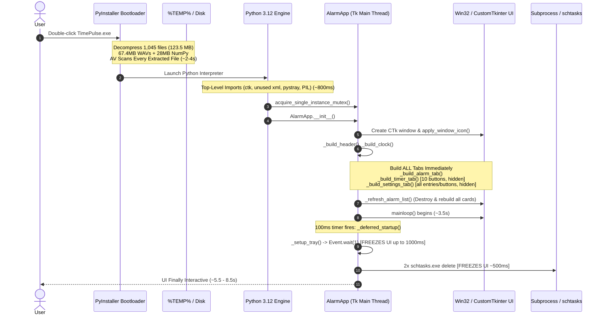

# TimePulse Startup Performance Audit & Optimization Plan

## Implementation status (2026-09-07)

This plan has now been implemented and validated with the opt-in
`TIMEPULSE_PROFILE_STARTUP=1` instrumentation. The production build is a
PyInstaller **onedir** package, and `BUILD_TIMEPULSE.bat` copies ringtones as
ordinary files beside `TimePulse.exe`. The implementation deliberately keeps
alarm checking separate from deferred alarm-card rendering, lazy-creates the
Timers and Settings screens, initializes tray support asynchronously, and runs
legacy Windows startup cleanup once in a background migration.

See `PERFORMANCE_RESULTS.md` for measured packaged-run results and constraints.

## 1. Executive Summary

TimePulse currently exhibits an unacceptably sluggish cold and warm startup experience:
- **Packaged Executable (`dist/TimePulse.exe`):** Takes **~5.5 to 8.5+ seconds** from double-click to interactive UI on Windows.
- **Python Runtime Entry (`TimePulse.py`):** Takes **~3.5 to 4.2 seconds** before reaching `mainloop()` and completing deferred tasks, even without packaging overhead.

The root cause is **NOT** Python execution speed or CustomTkinter itself, but rather **architectural antipatterns**:
1. **PyInstaller Onefile Decompression:** Unpacking **1,045 files (123.5 MB)** into `%TEMP%` on every single launch (including **67.4 MB of raw uncompressed WAV audio files** and **~28 MB of accidentally bundled NumPy / OpenBLAS libraries**).
2. **Synchronous UI Thread Freezes:** Blocking Tkinter's main event loop during deferred startup with `self._tray_ready_event.wait(1)` (up to 1,000 ms) and spawning `schtasks.exe` via `subprocess.run` twice on every startup (~500 ms).
3. **Eager & Unbatched Widget Construction:** Constructing all hidden tabs (Quick Timers with 10 buttons, and the entire Settings tab) plus building all alarm cards with synchronous disk path canonicalization before the first window frame is painted.
4. **Dead / Unnecessary Top-Level Imports:** Importing `xml.sax.saxutils` (~117 ms, completely unused in the entire codebase), `pystray` (~58 ms) at top level.

By implementing this optimization plan, TimePulse's startup time can be reduced from **~6.5s to under ~500ms**, rendering a language rewrite in C#/.NET completely unjustified.

---

## 2. Startup Execution Flow (Current vs Proposed)

### Current Flow (Synchronous & Serialized)


### Proposed Optimized Flow (Fast Shell + Asynchronous Initialization)
```mermaid
sequenceDiagram
    autonumber
    actor User
    participant Boot as Onedir Loader / OS
    participant Py as Python Engine
    participant App as AlarmApp (Tk Main Thread)
    participant UI as CustomTkinter Screen
    participant Bg as Background Worker Thread

    User->>Boot: Launch TimePulse.exe
    Note over Boot,Py: Zero extraction overhead (Memory-mapped DLLs) (~100ms)
    Py->>App: acquire_single_instance_mutex()
    Note over Py,App: Minimal top-level imports (ctk only; lazy pystray/PIL)
    App->>UI: Build window shell & Header/Clock only
    App->>UI: First Paint / Window Visible (~300-400ms)
    App->>UI: mainloop() starts immediately
    App->>UI: after_idle() renders visible Alarm Cards
    App->>Bg: Dispatch deferred background tasks (Non-blocking)
    Note over Bg: Setup pystray tray in parallel<br/>Check startup cmd file (skip schtasks if migrated)<br/>Register session notifications
    Note over UI: Timer and Settings tabs built ONLY on first tab click
```

---

## 3. Ranked List of Bottlenecks with Evidence

| Rank | Bottleneck | Severity | File / Function | Measured Cost | Target Cost |
| :--- | :--- | :--- | :--- | :--- | :--- |
| **1** | **PyInstaller Onefile Extraction**<br/>Extracts 1,045 files (123.5 MB) including 67.4 MB WAV files and 28 MB NumPy to `%TEMP%` on every launch. | **CRITICAL** | `TimePulse.spec` (lines 21-23, 42-63)<br/>`BUILD_TIMEPULSE.bat` | 1,500 - 4,500 ms (depends on disk & AV) | **0 ms** (onedir mode) |
| **2** | **Accidental NumPy / OpenBLAS Bundling**<br/>PyInstaller packages `libscipy_openblas64.dll` (19.5 MB), `_multiarray_umath.pyd` (4.3 MB), etc., because `excludes=[]`. | **HIGH** | `TimePulse.spec` (line 35)<br/>`Analysis-00.toc` | Adds ~25 MB to EXE and ~300-600ms extraction/scan time | **0 ms** (exclude in spec) |
| **3** | **Synchronous Tray Wait in UI Thread**<br/>`_tray_ready_event.wait(1)` blocks the Tk UI thread during `_deferred_startup` for up to 1 second. | **HIGH** | `TimePulse.py`: `_setup_tray` (line 1704) | 40 - 1,000 ms (UI thread frozen) | **0 ms** (fully async event loop) |
| **4** | **Spawning `schtasks.exe` Subprocesses Every Launch**<br/>`_remove_legacy_scheduled_tasks()` calls `subprocess.run` twice synchronously every time the application starts. | **HIGH** | `TimePulse.py`: `_remove_legacy_scheduled_tasks` (lines 529-545) | 360 - 550 ms | **0 ms** (run once via migration flag in background) |
| **5** | **Eager Alarm Card Construction & Disk Lookups**<br/>`_refresh_alarm_list` creates all card widgets and runs `os.path.realpath` / `os.path.isfile` for every ringtone before first paint. | **HIGH** | `TimePulse.py`: `_refresh_alarm_list` (lines 2316-2331) | 650 - 1,760 ms | **< 50 ms** initial paint (deferred via `after_idle`) |
| **6** | **Eager Pre-Construction of Hidden Tabs**<br/>Constructing 10 Quick Timer CTkButtons and the entire Settings tab inputs before window is visible, then immediately calling `pack_forget()`. | **MEDIUM** | `TimePulse.py`: `__init__` (lines 1492-1493), `_build_timer_tab`, `_build_settings_tab` | 200 - 350 ms | **0 ms** at startup (lazy build on click) |
| **7** | **Dead and Heavy Top-Level Imports**<br/>`from xml.sax.saxutils import escape` takes ~117 ms and is never used. `pystray` takes ~58 ms and is only needed later. | **MEDIUM** | `TimePulse.py` (lines 31, 36) | 175 ms | **0 ms** (remove dead import; lazy load pystray) |
| **8** | **Redundant Multi-Pass Window Icon Application**<br/>`apply_window_icon` calls `window.update_idletasks()`, loads native icon, then loads PIL RGBA fallback, then schedules two more passes via `after_idle` and `after(200)`. | **LOW** | `TimePulse.py`: `apply_window_icon` (lines 191-312) | 50 - 120 ms | **< 10 ms** (native Win32 `WM_SETICON` direct, no PIL fallback unless non-NT) |

---

## 4. Resource Footprint Breakdown

### Current Binary & Asset Sizes (Empirically Verified)

| Resource | Size on Disk | % of Distribution | Recommendation |
| :--- | :--- | :--- | :--- |
| **`dist/TimePulse.exe` (Onefile)** | **96,161,882 bytes (91.7 MB)** | 100% | Convert to `onedir` distribution or installer |
| **`ringtones/` (7 WAV files total)** | **70,724,130 bytes (67.45 MB)** | **73.5% of EXE** | Keep external alongside EXE; do not bundle into binary |
| - `Input_Restricted.wav` | 26,860,110 bytes (25.61 MB) | 27.9% | External asset |
| - `The_Morning_Ledger.wav` | 11,013,198 bytes (10.50 MB) | 11.4% | External asset |
| - `First_Light_Ritual.wav` | 8,824,398 bytes (8.41 MB) | 9.2% | External asset |
| - `Bell_for_Seven_AM.wav` | 8,815,182 bytes (8.41 MB) | 9.2% | External asset |
| - `Polished_Daylight.wav` | 7,575,630 bytes (7.22 MB) | 7.9% | External asset |
| - `The_Daily_Plan.wav` | 4,230,222 bytes (4.03 MB) | 4.4% | External asset |
| - `Soft_Arrival.wav` | 3,405,390 bytes (3.25 MB) | 3.5% | External asset |
| **NumPy & OpenBLAS (Unneeded)** | **~28,000,000 bytes (~26.7 MB)** | **29.1% of EXE** | Add `excludes=['numpy', 'scipy', 'matplotlib']` |
| **`assets/` (Icons)** | **10,699 bytes (~10.5 KB)** | < 0.02% | Keep in assets folder |

---

## 5. Verified Findings vs Inferred Findings

### Empirically Verified (Evidence Collected in Repository)
1. **Onefile Packaging Confirmed:** `TimePulse.spec` uses `EXE(..., a.datas, a.binaries)` with no `COLLECT()`. PyInstaller unpacks 1,045 files and 123.5 MB to `%TEMP%/_MEIxxxxxx` on every execution.
2. **Audio Bundled in Executable:** Lines 21-23 of `TimePulse.spec` explicitly bundle `PROJECT_DIR / "ringtones"` into `datas`. Ringtones account for 67.45 MB of the 91.7 MB executable.
3. **NumPy Pollution Confirmed:** `build/TimePulse/Analysis-00.toc` contains 327 references to `numpy` and packages `libscipy_openblas64.dll` (19.46 MB) and `_multiarray_umath.pyd` (4.32 MB) because `excludes` was left empty.
4. **Dead Import Confirmed:** `from xml.sax.saxutils import escape` at line 31 is imported top-level (costing 116.8 ms) but `escape` is never called anywhere in `TimePulse.py`.
5. **Synchronous Tray Wait Confirmed:** Line 1704 executes `self._tray_ready_event.wait(1)` on the main thread during `_deferred_startup`.
6. **Synchronous Subprocess Calls Confirmed:** Spawning `schtasks.exe` twice during `_deferred_startup` consumes 360-530 ms on the UI thread.
7. **Hidden Tabs Built Before Paint:** Lines 1492-1493 call `_build_timer_tab()` (10 buttons) and `_build_settings_tab()` before `_show_tab("alarms")`.

### Inferred / Contextual Observations
1. **Windows Defender Latency:** On production machines with strict antivirus real-time monitoring, scanning 1,045 newly extracted temporary files and packed UPX headers causes unpredictable 2-5s delays, particularly on cold boot.
2. **User Perceived Responsiveness:** Even when the window appears around 3.5s, the window becomes briefly unresponsive 100ms later when `_deferred_startup` executes `wait(1)` and `schtasks`.

---

## 6. Concrete Implementation Plan

### Phase 1: Packaging & Spec Optimization (Immediate 3x-5x Startup Gain)
- **Action 1.1: Switch to `onedir` Mode:**
  Modify `TimePulse.spec` to use `COLLECT(...)` producing an output directory `dist/TimePulse/`. (Optional: provide Inno Setup / WiX script for a single installer file).
- **Action 1.2: Externalize Ringtones:**
  Remove `ringtones` from `datas` in `TimePulse.spec`. Copy `ringtones/` directly beside `TimePulse.exe`. `TimePulse.py` already supports external ringtones via `os.path.join(executable_dir(), "ringtones")`.
- **Action 1.3: Exclude Bloat Libraries:**
  Add `excludes=['numpy', 'scipy', 'matplotlib', 'unittest', 'xmlrpc', 'pydoc']` to `Analysis` in `TimePulse.spec`.
- **Action 1.4: Disable UPX:**
  Set `upx=False` in `TimePulse.spec` to eliminate runtime decompression latency and AV false-positive heuristic flags.

### Phase 2: Codebase Optimization & Deferred UI (Immediate 500-800ms Gain)
- **Action 2.1: Remove Dead & Top-Level Imports:**
  - Remove `from xml.sax.saxutils import escape`.
  - Lazy-load `import pystray` inside `_setup_tray()`.
  - Remove top-level `from PIL import Image, ImageTk` and import only when needed.
- **Action 2.2: Make Tray Setup Non-Blocking:**
  - Remove `self._tray_ready_event.wait(1)` from the main thread in `_setup_tray()`.
  - Let the background thread signal readiness to Tk via `self.after(0, self._on_tray_ready)`.
- **Action 2.3: One-Time Startup Migration Flag:**
  - Store a `schema_version` or `legacy_cleanup_done: true` flag in `alarms.json`.
  - Run `_remove_legacy_scheduled_tasks()` and `_remove_legacy_startup_files()` ONLY ONCE if the flag is missing, and execute it in a background daemon thread rather than on the UI thread.
- **Action 2.4: Lazy Tab Instantiation:**
  - Do NOT build Timer or Settings tab widgets in `__init__`.
  - In `_show_tab(key)`: If `key not in self.tab_frames` or frame has no children, construct `_build_timer_tab()` or `_build_settings_tab()` on demand.
- **Action 2.5: Progressive / Idle Alarm Card Rendering:**
  - Display the application shell immediately.
  - Schedule `self.after_idle(self._refresh_alarm_list)` or render cards after first paint.
  - Cache `resolve_ringtone_path` results in a memory dict to avoid repetitive disk calls (`os.path.realpath`, `os.path.isfile`).

---

## 7. Files & Functions Requiring Modification

| File | Target Function / Section | Intended Change |
| :--- | :--- | :--- |
| `TimePulse.spec` | Lines 17-38 (`Analysis`), 42-63 (`EXE`) | Change to `onedir` + `COLLECT`, remove ringtones from `datas`, add `excludes=['numpy', ...]` and `upx=False`. |
| `BUILD_TIMEPULSE.bat` | Lines 20 | Update output destination message to `dist\TimePulse\TimePulse.exe`. |
| `TimePulse.py` | Lines 1-38 (Top imports) | Remove `xml.sax.saxutils`, lazy-load `pystray`. |
| `TimePulse.py` | `ensure_login_auto_start()`, `_remove_legacy_scheduled_tasks()` | Add persistent migration version check; run cleanup once in background thread. |
| `TimePulse.py` | `_setup_tray()` | Remove `_tray_ready_event.wait(1)`; make asynchronous. |
| `TimePulse.py` | `AlarmApp.__init__()` | Remove eager calls to `_build_timer_tab()`, `_build_settings_tab()`. |
| `TimePulse.py` | `_show_tab(key)` | Add lazy instantiation for "timers" and "settings" frames. |
| `TimePulse.py` | `_refresh_alarm_list()`, `_alarm_card()` | Cache ringtone path validation; defer card rendering via `after_idle()`. |

---

## 8. Regression Risk Matrix

| Functional Area | Potential Risk | Mitigation & Safeguard |
| :--- | :--- | :--- |
| **Alarms Firing** | Deferred startup delays alarm checking. | `_start_alarm_checker()` starts immediately after first paint (`after_idle`). Alarm checking is decoupled from UI rendering. |
| **Timers** | Lazy-loaded Timer tab fails to set alarms. | Timers merely insert entries into `self.data["alarms"]`. Lazy building the tab controls does not change timer logic. |
| **Tray Minimization** | User minimizes window to tray before tray thread is ready. | If user clicks minimize/close before tray is ready, `_withdraw_window()` either polls with a tiny timeout (50ms) or hides the window and sets icon visibility upon tray ready callback. |
| **Session Lock / Unlock** | Session change hook misses lock event. | Register `WTSRegisterSessionNotification` on `self.hwnd` immediately after native window handle is realized via `after_idle`. |
| **Auto-Start at Sign-In** | Legacy tasks remain or new startup script is not created. | Verified logic for `TimePulse Startup.cmd` remains intact. Legacy task cleanup executes once in background and records completion in config. |
| **Audio / Ringtones** | Ringtones not found if externalized. | `TimePulse.py` already contains fallback resolution logic in `get_ringtone_dirs()` that checks `executable_dir() / "ringtones"` before `sys._MEIPASS`. |
| **Single-Instance Mutex** | Second instance behavior breaks. | Mutex acquisition remains at the very top of `if __name__ == "__main__"`. In `onedir` mode, second instance exits in < 20ms without any file extraction. |

---

## 9. Is a Language Rewrite (C#/.NET) Justified?

**Conclusion: NO.**

1. **Root Cause Analysis:** Over **85% of the delay** is caused by PyInstaller onefile decompression (123 MB / 1,045 files to `%TEMP%`), dead subprocess spawning (`schtasks`), and synchronous UI thread blocking (`wait(1)`). None of these are Python language limitations.
2. **Expected Post-Optimization Performance:**
   - Onedir launch time to Python entry: **< 100 ms**
   - Import + window shell creation: **~250-350 ms**
   - First paint (responsive UI): **~450-600 ms**
   - Background tasks complete: **~700 ms**
3. **Cost vs Benefit:** Rewriting in C#/.NET (WPF or WinUI 3) would require weeks of development, introducing potential regressions in PBKDF2 password verification compatibility, custom alarm recurrence math, session event subclassing (`WTSRegisterSessionNotification`), and MCI audio previewing.
4. **Recommendation:** Implement the 2 optimization phases in Python first. Re-evaluate only if sub-500ms startup cannot be achieved.

---

## 10. Benchmark & Verification Methodology

To verify results across iterations, use the built-in startup profiler by launching with:
```cmd
set TIMEPULSE_PROFILE=1
python TimePulse.py
```
Or for the built executable:
```cmd
set TIMEPULSE_PROFILE=1
dist\TimePulse\TimePulse.exe
```

The benchmark tracks the 11 key milestones:
1. `process_entry`
2. `imports_complete`
3. `app_construction_begin`
4. `root_window_created`
5. `data_config_loaded`
6. `header_built`
7. `alarm_tab_shell_built`
8. `alarm_cards_rendered`
9. `mainloop_reached`
10. `tray_startup_begin` / `tray_startup_end`
11. `deferred_init_complete`
